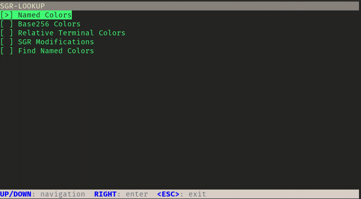
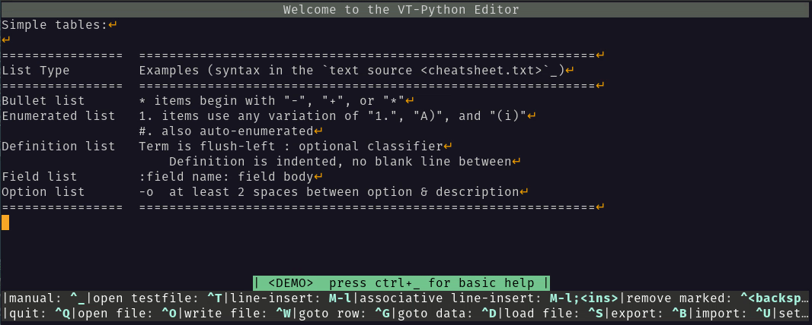
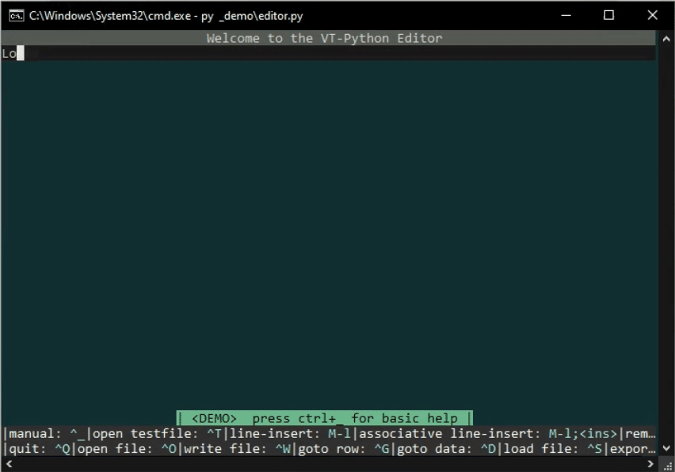
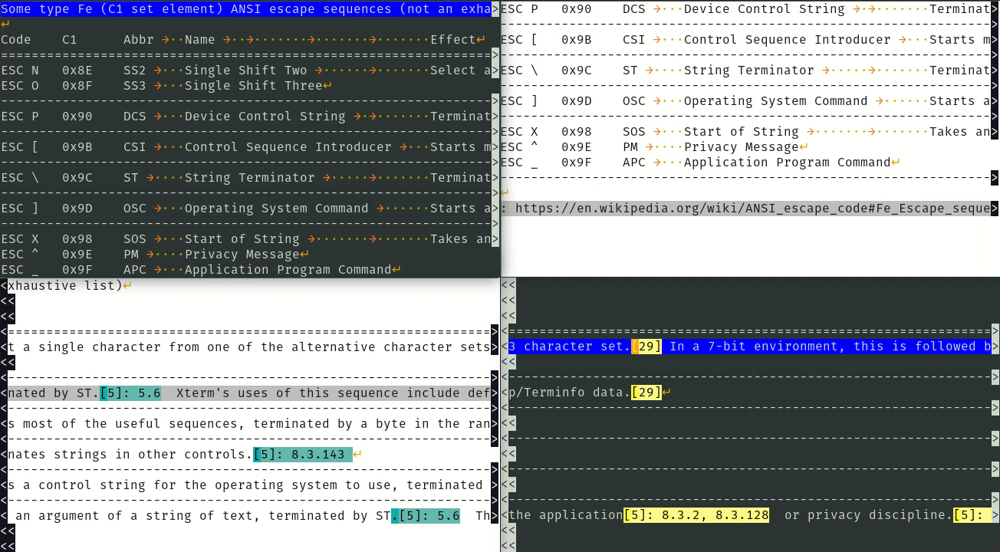

.. role:: html(raw)
   :format: html

.. .. image:: ./_doc/pics/building_site.png
    :width: 120
    :alt: building_side.png

The [ Video Terminal Python ] Project
#####################################

**(p-α)**

Statute
=======

The goal of the project is to create a comprehensive Python library, for creating text-based user interfaces
in the terminal emulator.

The current build-out includes a module for the Linux/Windows platform independent modification of the
emulator; several modules for categorizing, cataloging, handling, interpreting, and processing data types,
data inputs, and the ANSI escape sequences; a package for technical processing of an unblocked stdin stream;
and the first basic modules and objects for implementing text-based widgets.

The development is done by myself on a hobby basis, the progress can be seen under the
`Version List`_. There is also a full documentation available in the Wiki_.

Reports, ideas and questions are very welcome and can be directed to
:html:`<a href="mailto:srccircumflex@outlook.com?subject=The%20VT-Python%20Project">
srccircumflex@outlook.com</a>`.

Presentations
=============

Window grid and mouse support
-----------------------------

.. image:: ./_doc/gifs/Grid.gif
    :align: center
    :width: 1050
    :alt: Grid.gif
    :target: ./_demo/Grid.py

→ `demo widgets`_

SGR Lookup
----------

→ `demo sgr_lookup_tui`_

Find in Buffer
--------------

.. image:: ./_doc/gifs/FindInBuffer.gif
    :align: center
    :width: 1050
    :alt: FindInBuffer.gif
    :target: ./_demo/editor.py

→ `demo editor`_

Insert Modes
------------

→ `demo editor`_

Highlighter Demo
----------------

Tab Shifting
------------

→ `demo editor`_

Markers
-------

→ `demo editor`_

.. _Version List: https://github.com/srccircumflex/TheVTPyProject/wiki/version-list
.. _Wiki: https://github.com/srccircumflex/TheVTPyProject/wiki

.. _demo editor: ./_demo/editor.py
.. _demo sgr_lookup_tui: ./_demo/sgr_lookup_tui.py
.. _demo widgets: ./_demo/widgets.py
